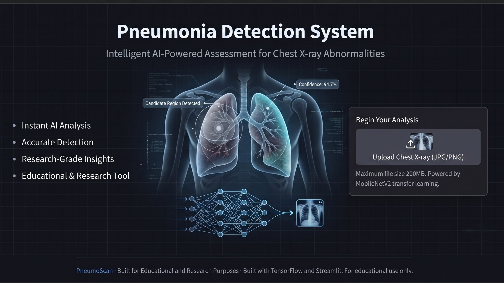

# My Pneumonia Detector

This is my own educational rebuild of a pneumonia X-ray classification project.

The goal is to train a deep learning model that can classify chest X-ray images as:

🔗 Live Demo: [pneumonia-detectionsystem.streamlit.app](https://pneumonia-detectionsystem.streamlit.app/)




- `NORMAL`
- `PNEUMONIA`

The current model is trained only on sample images .

This project is for learning only. It is not a medical diagnosis tool.

## Project Structure

```text
my-pneumonia-detector/
  app.py
  train_model.py
  predict.py
  requirements.txt
  README.md
  data/
    chest_xray/
      train/
      val/
      test/
  model/
  sample_images/
```

## Dataset

Use the public Kaggle dataset **Chest X-Ray Images (Pneumonia)**.

Place it like this:

```text
data/chest_xray/train/NORMAL/
data/chest_xray/train/PNEUMONIA/
data/chest_xray/val/NORMAL/
data/chest_xray/val/PNEUMONIA/
data/chest_xray/test/NORMAL/
data/chest_xray/test/PNEUMONIA/
```

## Setup

```powershell
python -m venv .venv
.\.venv\Scripts\Activate.ps1
pip install -r requirements.txt
```

## Google Authentication

The Streamlit app requires Google login before users can upload X-ray images or
run predictions.

1. Create a Google OAuth client ID in Google Cloud Console.
2. Add this authorized redirect URI for local development:

```text
http://localhost:8501/oauth2callback
```

For Streamlit Community Cloud, also add your deployed app URL plus
`/oauth2callback`.

3. Copy the example secrets file:

```powershell
Copy-Item .streamlit\secrets.example.toml .streamlit\secrets.toml
```

4. Fill in `client_id`, `client_secret`, and a strong `cookie_secret`.
5. Keep `server_metadata_url` set to Google's value:

```text
https://accounts.google.com/.well-known/openid-configuration
```

6. Optionally set `[app].allowed_emails` to restrict which Google accounts can
   use the app.

Never commit `.streamlit/secrets.toml`.

## Train

```powershell
python train_model.py
```

## Run The App

```powershell
streamlit run app.py
```

Then open the local URL shown by Streamlit.

## Deploy

The easiest deployment option is Streamlit Community Cloud.

Basic steps:

1. Push this project to a GitHub repository.
2. Make sure these files are included:

```text
app.py
predict.py
requirements.txt
model/pneumonia_detector.keras
model/class_names.txt
```

3. Create a new Streamlit app from the GitHub repository.
4. Set the app entry file to:

```text
app.py
```

Note: the current model is trained with only sample images, so it is useful for demonstrating the pipeline, not for real diagnosis.
